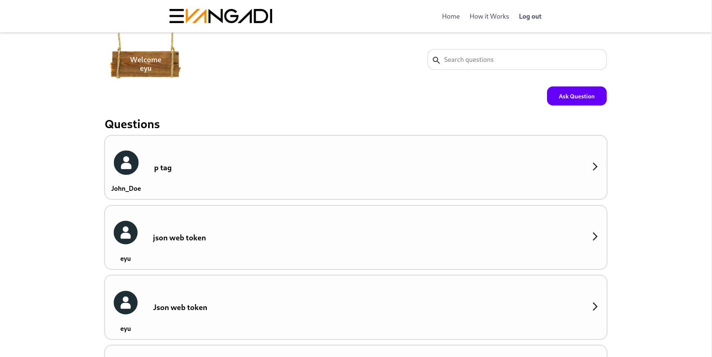
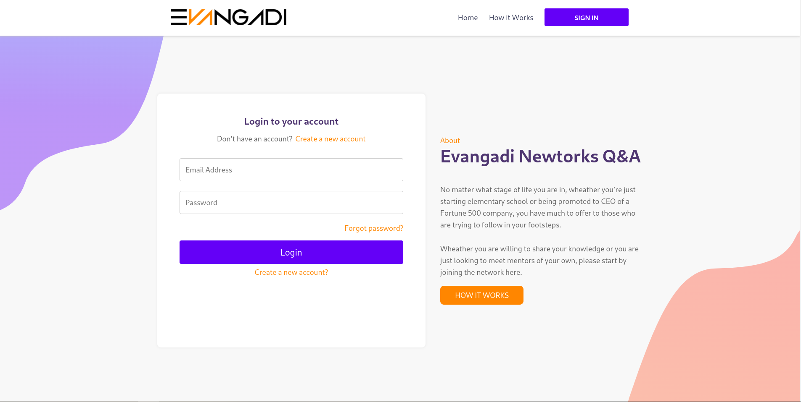
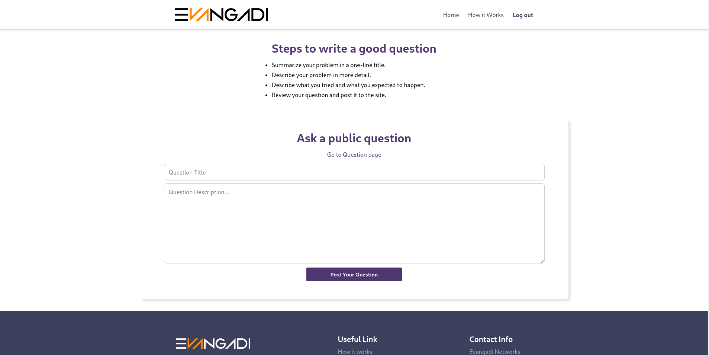
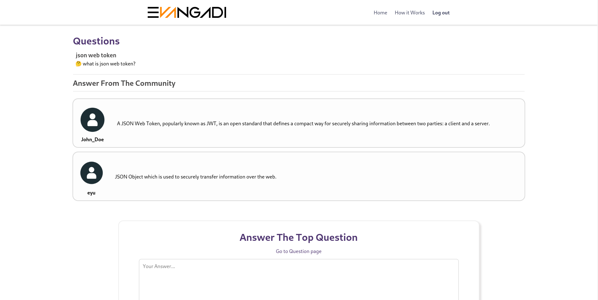

# Evangadi Forum Project / Q&A Website

## Frontend
- ReactJs

## Backend
- NodeJs 
  
## includes
- ExpressJs
- Mysql
- JWT Authorization

Website Link : [Evangadi-Forum](https://forum-frontend-100.pages.dev/login)

* Home page

* Login page

* Question page

* Answer page
